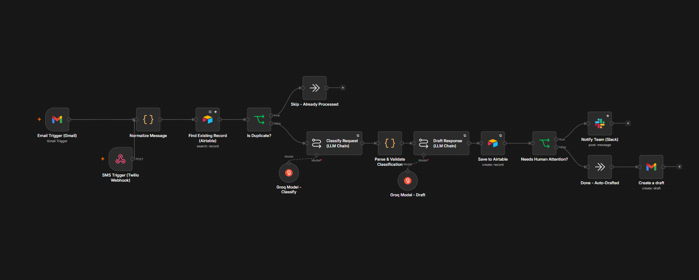

# Support Triage
### An n8n automation that reads, classifies, and drafts replies to customer messages across email and SMS

---

## The problem

Most small and mid-sized businesses run their customer support through one shared inbox. Every message, whether it's a billing question, a login issue, or a refund request, gets read manually, sorted manually, and routed manually. That works fine at low volume. It breaks down fast as a business grows, and the cost isn't just slower response times. It's refunds sitting unanswered, technical issues getting buried under general questions, and no consistent record of what came in or how it was handled.

I built this automation to solve that specific problem: read every incoming request, understand what it actually is, and get it in front of the right person fast, without removing a human from the loop.

## What it does

A customer sends a message by email or text. The automation:

1. Normalizes it into one common format, regardless of channel
2. Checks whether it's already been processed, to prevent duplicate work
3. Classifies it into one of six categories: Billing, Access, Scheduling, Technical Support, General Question, or Refund Request, with a confidence score
4. Drafts a reply for a human to review, never sends anything automatically
5. Logs the full record: message, category, confidence, draft, and status
6. Notifies the team in Slack immediately if the request is a refund, the AI wasn't confident, or the message needs a second look for any reason

Everything else, the messages that are clear and low-risk, sits quietly in a queue for an agent to pick up on their own schedule. No noise unless something actually needs attention.

## Why it's built this way

**The AI assists. It doesn't decide.** Every draft reply gets reviewed by a person before anything reaches a customer. This was a deliberate constraint, not a limitation. Support automation that skips this step tends to fail in the exact moments that matter most: refunds, angry customers, ambiguous requests. Keeping a human in the loop for those cases while automating everything else gets most of the time savings without most of the risk.

**Confidence has to mean something.** Language models will report high confidence by default if you let them. I wrote the classification prompt to explicitly penalize vague or multi-topic messages, so a message like "hi can you help" scores low instead of getting treated the same as a clear, single-topic request. Without that instruction, a confidence score is decoration, not a real signal.

**A bad AI response can never fail silently.** Right after classification, a validation step checks that the output is actually usable: real JSON, a real category. If the model returns something malformed, the system doesn't crash and it doesn't guess. It defaults to General Question, drops confidence to zero, and flags the message for a human, every time. The failure mode is always "a person looks at this," never "this message disappears."

**Channel doesn't matter past the first step.** Email and SMS get converted into one shape immediately, so every node after that point works identically regardless of where the message came from. Adding a new channel later, like WhatsApp or a contact form, is a matter of plugging in a new trigger, not rebuilding the logic.

## How it's built

- **Platform:** n8n
- **AI:** Groq (Llama 3.3 70B), via a Basic LLM Chain node structure
- **Storage:** Airtable, one record per message with category, confidence, draft, and status
- **Notifications:** Slack
- **Triggers:** Gmail (polling) and a Twilio webhook for SMS
- **Error handling:** a linked error workflow that catches any unhandled failure and posts the details straight to Slack, so nothing fails without someone knowing

## What I ran into building it, and how I handled it

I want to be upfront about this because I think it's a more honest picture of the work than a clean success story.

I originally scoped this against OpenAI, didn't have a paid key on hand, and moved to a free-tier provider instead. That came with real friction: account verification quirks, quota limits that had nothing to do with actual usage, and a billing sync bug that turned out to be a known, active issue on the provider's side rather than something fixable client-side. I ended up moving to Groq, and the useful thing that came out of that whole detour: the classification and drafting prompts never needed a single word changed across three different providers. That's a good sign they were written generically from the start, as instructions rather than tied to any one API's syntax.

I also hit a real bug during testing where every message was coming back classified as General Question regardless of content. Instead of assuming the prompt was bad, I checked what the model actually received, and traced it to the system prompt not being wired into the field the node actually expected. Fixed the wiring, not the prompt, and it started working correctly. Two smaller issues came up the same way: Airtable rejecting a timestamp because Gmail's date format wasn't ISO 8601, and HTML entities leaking into message text from Gmail's API. Both got fixed once, at the normalization step at the very start of the pipeline, instead of being patched separately in every place they showed up downstream.

## What I'd add before running this in production

- Track how often a human edits the AI's draft versus sending it as-is, and use that data to decide which categories are safe to eventually auto-send
- Calibrate the confidence threshold against real outcomes instead of an initial estimate
- Add thread awareness, so a back-and-forth conversation isn't treated as unrelated new messages each time
- Connect the draft-writing step to real help documentation, so it can reference actual policy instead of using a placeholder for anything specific

## Why this matters for a business

This isn't about replacing a support team. It's about removing the manual sorting step from every single message, so the team's time goes into responding, not figuring out what they're looking at. For a business handling even a few dozen requests a day, that adds up to a faster first response, a full record of every request and how it was handled, and one guarantee that matters more than the rest: a refund request never sits unanswered just because it landed in a busy inbox at the wrong time.
